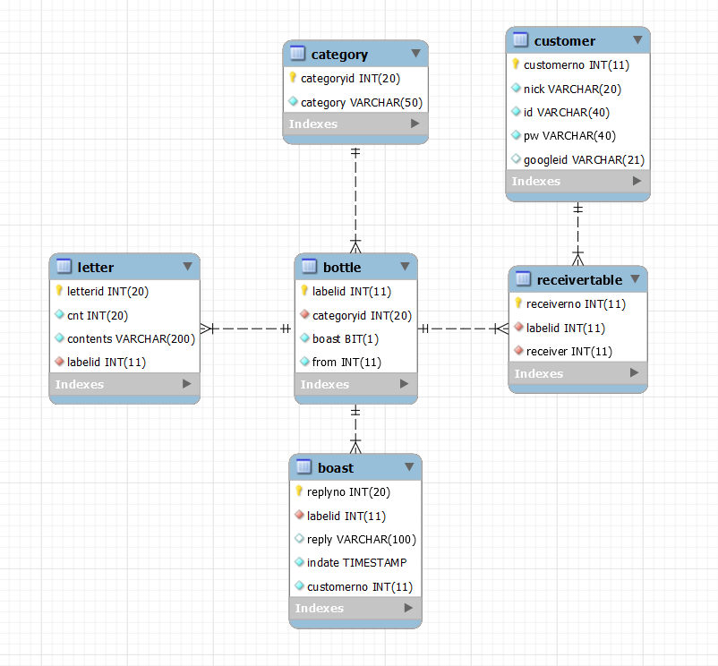
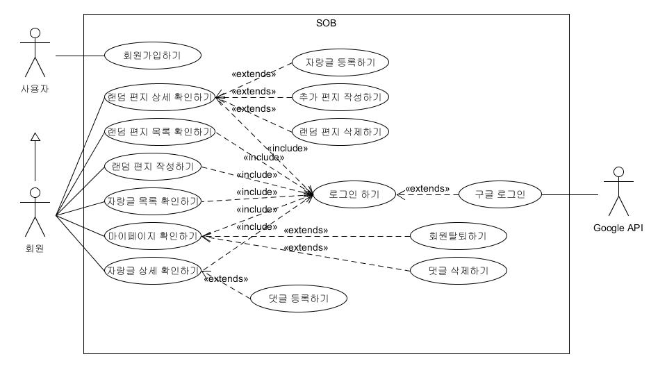

# Sea-Of-Bottle


## 개요

- 유리병 편지 컨셉트

- 회원이 편지를 작성하면 작성자를 제외한 회원 중 한 명에게 무작위로 전송하는 시스템

- 한 게시물(유리병)에 최대 3개의 편지 추가 가능

- 마지막 수신자는 모든 회원이 볼 수 있는 자랑게시판에 등록 가능

- 자랑게시판에 등록된 편지는 회원 누구나 댓글을 작성 가능


## 개발 목표

- 작성자를 제외한 회원 중 한 명에게 100자 제한의 짧은 편지를 작성해 무작위로 전송할 수 있다.
- 이메일 인증과 구글 로그인을 통해 사용자 계정을 생성할 수 있다.
- 회원 탈퇴 및 로그아웃을 할 수 있다.
- 게시판 형태로 받은 편지 목록을 확인할 수 있다. (카테고리 별 조회 가능)
- 게시판 형태로 자랑한 편지 목록을 확인할 수 있다. (카테고리 별 조회 가능)
- 자랑한 편지 상세보기 페이지에서 댓글을 확인하고 작성할 수 있다.
- 게시판 형태로 자신이 자랑한 편지 목록을 확인할 수 있다. (카테고리 별 조회 가능)
- 게시판 형태로 자신이 작성한 댓글 목록을 확인 및 삭제할 수 있다.


## 개발기간 (104시간 / 2인)
||기획|구현1|구현2|UI 개선|서버 배포|
|:-:|:-:|:-:|:-:|:-:|:-:|
|08/19|*|||||
|08/20|*|||||
|08/21|*|||||
|08/23||*||||
|08/24||*||||
|08/25||*||||
|08/26||*|*|||
|08/27||*|*|*||
|08/30|||*|*||
|08/31|||*|*||
|09/01|||*|*||
|09/02|||*||*|
|09/03|||*||*|


## 개발 환경

- eclipse Version: 2020-03 (4.15.0)

- JavaSE-1.8

- MariaDB 5.5

- Apache Tomcat v9.0

- Spring 5.0.7.RELEASE


## 개발 문서

### ER Diagram



### UseCase Diagram



## 예시 화면

##### 로그인


##### 편지 목록


##### 편지 상세


## 학습 내용

##### oaoing
- Google Login API oauth 2.0

  

> <small>[Google ID 플랫폼](https://developers.google.com/identity/protocols/oauth2 )</small>

- Spring error 페이지 처리

```xml
<error-page>
	    <error-code>400</error-code>
	    <location>/WEB-INF/views/error/error400.jsp</location>
</error-page>
	<error-page>
    	<location>/WEB-INF/views/error/error.jsp</location>
</error-page>
```
> <small>web.xml</small>

- Spring email 전송
```xml
<bean id="mailSender" 
		class="org.springframework.mail.javamail.JavaMailSenderImpl">
        <property name="host" value="smtp.gmail.com" /> <!-- gmail을 사용 -->
        <property name="port" value="587" />
        <property name="username" value="#" />
        <property name="password" value="#" />
        <property name="javaMailProperties">
            <props>
                <prop key="mail.transport.protocol">smtp</prop>
                <prop key="mail.smtp.auth">true</prop>
                <prop key="mail.smtp.starttls.enable">true</prop>
                <prop key="mail.debug">true</prop>
                <prop key="mail.smtp.ssl.trust">smtp.gmail.com</prop>
				<prop key="mail.smtp.ssl.protocols">TLSv1.2</prop>
            </props>
        </property>
    </bean>
```
> <small>root-context.xml / bean 설정</small>

```java
@Service
@Log4j
@AllArgsConstructor
public class LoginServiceImpl implements LoginService {
    
    @Inject
    private JavaMailSender mailSender; // root-context.xml에 설정한 bean, 의존성을 주입

    @Override
        public String sendMail(String email) {

            ...

            MimeMessage msg = mailSender.createMimeMessage();

            msg.addRecipient(RecipientType.TO, new InternetAddress(email));
            msg.addFrom(new InternetAddress[] { new InternetAddress("email", "name") });

            msg.setSubject("Title", "utf-8");
            msg.setText("Contents", "utf-8");
            mailSender.send(msg);

            ...

    }
}
```
> <small>org.sob.service.LoginServiceImpl.java / sendMail 일부</small>

- HTTP Session을 통한 로그인 관리

```java
@Log4j
@Controller
@AllArgsConstructor
public class LoginController {
	
	private LoginService service;
    
	@RequestMapping(value = "/login", method = RequestMethod.POST)
	public String loginCheck(HttpServletRequest httpServletRequest, HttpSession session, Model model) {
		
		...
		
		log.info("로그인 성공");
		session.setAttribute("uvo", user);	// 유저 정보 세션에 저장
		session.setMaxInactiveInterval(30*60);	// 30분동안 지속
		return "redirect:/sob/main";
	}
```
> <small>org.sob.controller.LoginController.java / loginCheck 일부</small>


##### shin-seoung-gyun
- HTTP Session을 통한 유저데이터 관리
```java
@GetMapping("/main")
	public void list(Model model,@SessionAttribute("uvo") UserVO uvo, Criteria cri) {
		if(cri.getCategoryid()==0) {
			cri.setCustomerno(uvo.getCustomerno());
			model.addAttribute("categoryList",service.getCategoryList());
			model.addAttribute("pageMaker",new PageDTO(cri,service.getTotal(cri)));
			model.addAttribute("list", service.getList(cri));
		} else {
			cri.setCustomerno(uvo.getCustomerno());
			model.addAttribute("categoryList",service.getCategoryList());
			model.addAttribute("pageMaker",new PageDTO(cri,service.getListUseCategoryTotal(cri)));
			model.addAttribute("list", service.getListUseCategory(cri));
		}
	}
```
> <small>org.sob.controller.MainController/ list 일부</small>

- transactional 어노테이션을 활용한 DataBase insert
```xml
<!-- 트랜젝션 매니저 -->
	<bean id="transactionManager" class="org.springframework.jdbc.datasource.DataSourceTransactionManager">
		<property name="dataSource" ref="dataSource"></property>
	</bean>
	
	<!-- @Transactional 어노테이션을 scan하기 위한 설정 -->
	<tx:annotation-driven/>
```
> <small>root-context.xml / transactional 설정</small>

```java
	@Override
	@Transactional
	public void register(MainVO mvo) {
		List<UserVO> uvoList = mapper.getCustomerNo();
		List<Integer> intList = new ArrayList<>();
		int myNo = mvo.getFrom();
		for(int i = 0; i<uvoList.size(); i++) {
			int no = uvoList.get(i).getCustomerno();
			if(myNo==no) {
				continue;
			} else {
				intList.add(no);
			}
		}
		Date date_now = new Date(System.currentTimeMillis()); 
		SimpleDateFormat fourteen_format = new SimpleDateFormat("HHmmss");
		Random rand = new Random(Integer.parseInt(fourteen_format.format(date_now) + myNo));
		
		int result = intList.get(rand.nextInt(uvoList.size()-1));
		mvo.setTo(result);
		
		mapper.bottleInsert(mvo);
		mvo.setLabelid(mapper.selectLabelid());
		mapper.letterInsert(mvo);
		mapper.receivertableInsert(mvo);
		ReplyVO rvo = new ReplyVO();
		rvo.setLabelid(mvo.getLabelid());
		rvo.setCustomerno(myNo);
		mapper.boastInsert(rvo);
	}
```
> <small>org.sov.service.MainServiceImpl / register 일부</small>

- interceptor를 활용한 post전동 후의 돌아가기 기능 으로 인한 중복 방지
```xml
<interceptors> 
<beans:bean id="webContentInterceptor" class="org.springframework.web.servlet.mvc.WebContentInterceptor">
 <beans:property name="cacheSeconds" value="0"/>
 <beans:property name="useExpiresHeader" value="true"/>
 <beans:property name="useCacheControlHeader" value="true"/>
 <beans:property name="useCacheControlNoStore" value="true"/>
</beans:bean>
</interceptors>
```
> <small>servlet-context.xml 의 bean설정</small>
